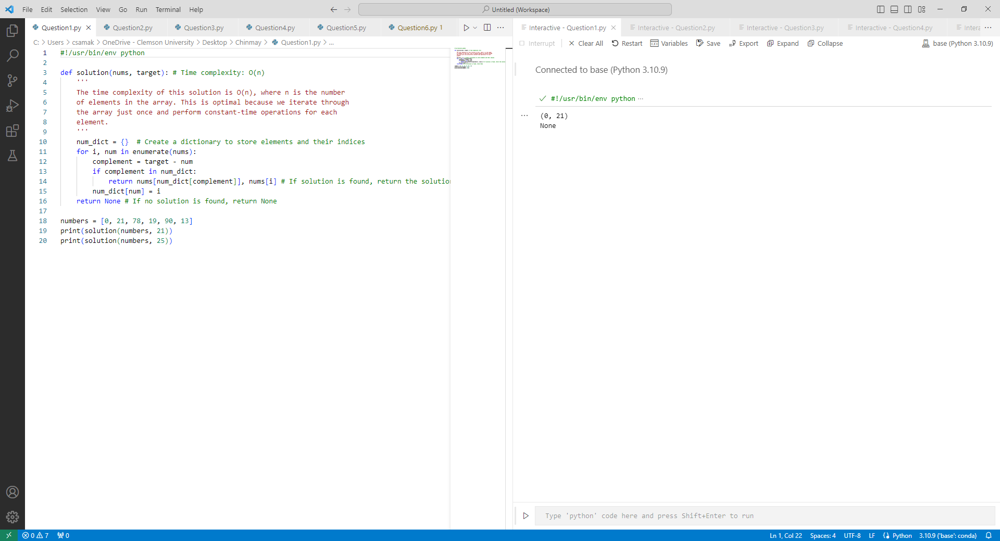
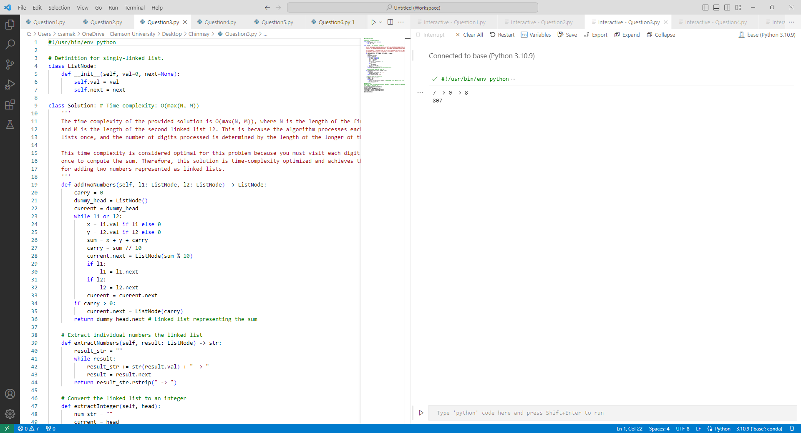
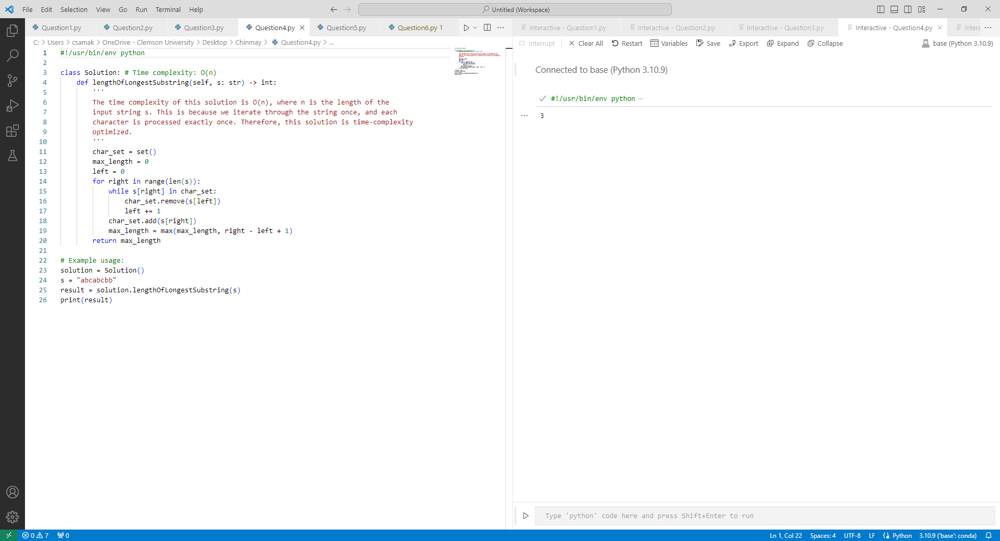
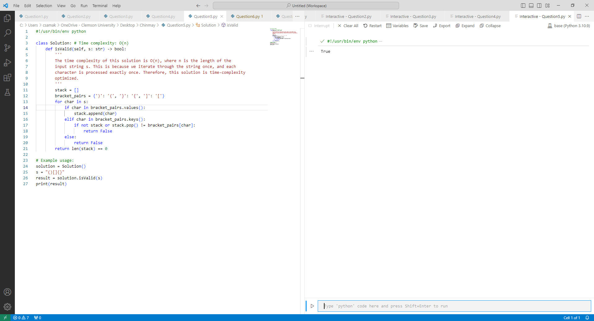
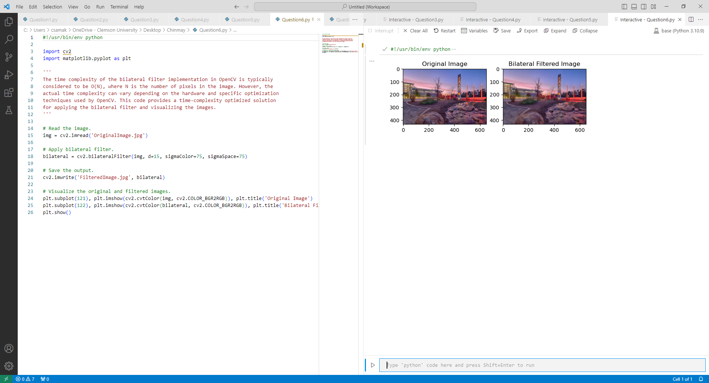
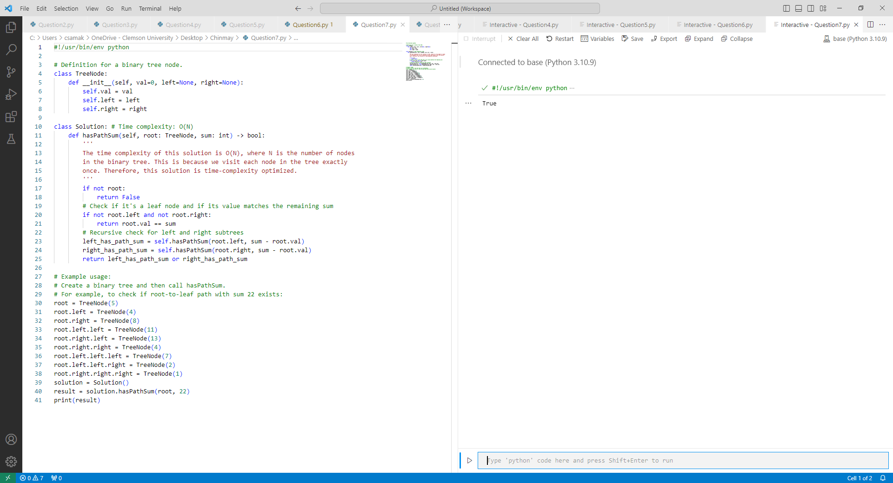
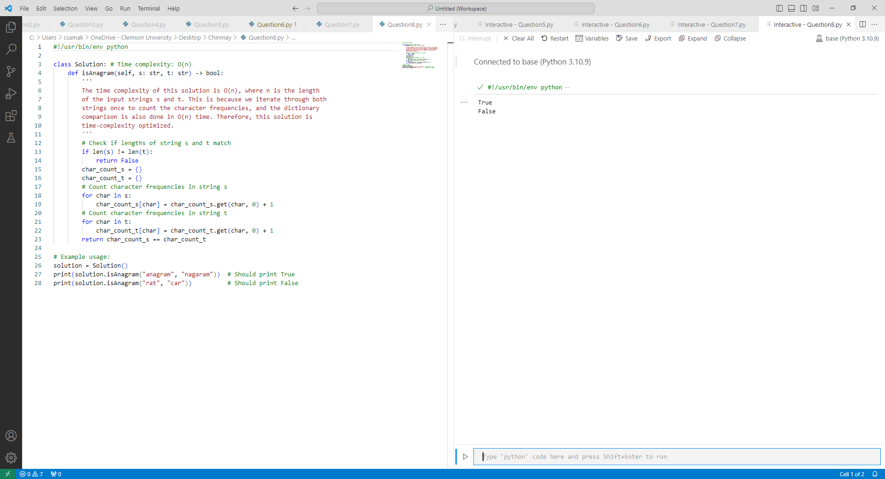

# AuE-8930: Homework 3
**Author:** Chinmay Samak

## SETUP

1. Clone this repository.
    ```bash
    $ git clone https://github.com/Tinker-Twins/Computing-and-Simulation-for-Autonomy.git
    ```
2. Change working directory.
    ```bash
    $ cd Computing-and-Simulation-for-Autonomy/HW3/Chinmay
    ```
3. Make all Python scripts executable.
    ```bash
    $ sudo chmod +x *.py
    ```
4. Install OpenCV (required for Part A Question 6):
    ```bash
    $ pip install opencv-contrib-python
    ```

## USAGE

Execute the Python scripts for each of the questions:
```bash
$ python Question1.py
$ python Question2.py
$ python Question3.py
$ python Question4.py
$ python Question5.py
$ python Question6.py
$ python Question7.py
$ python Question8.py
$ python ExtraQuestion1.py
$ python ExtraQuestion2.py
$ python ExtraQuestion3.py
$ python ExtraQuestion4.py
$ python ExtraQuestion5.py
$ python ExtraQuestion6.py
```

## RESULTS








