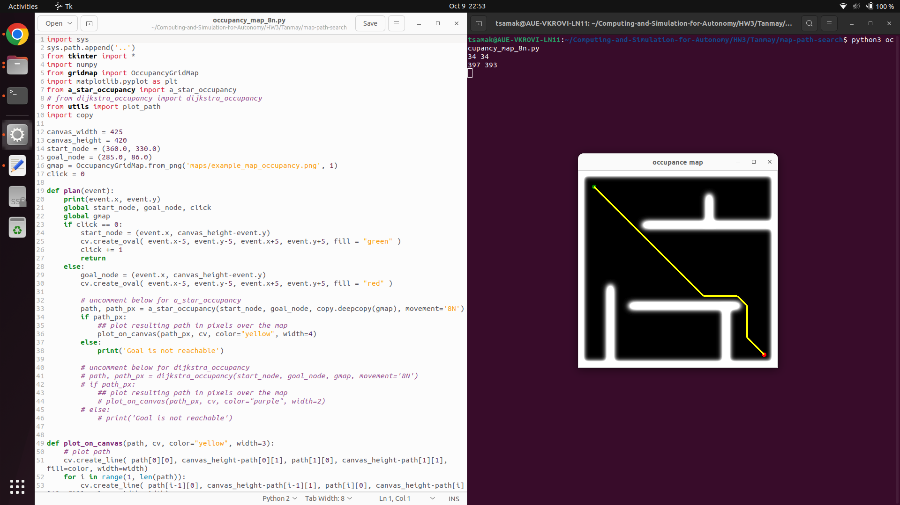
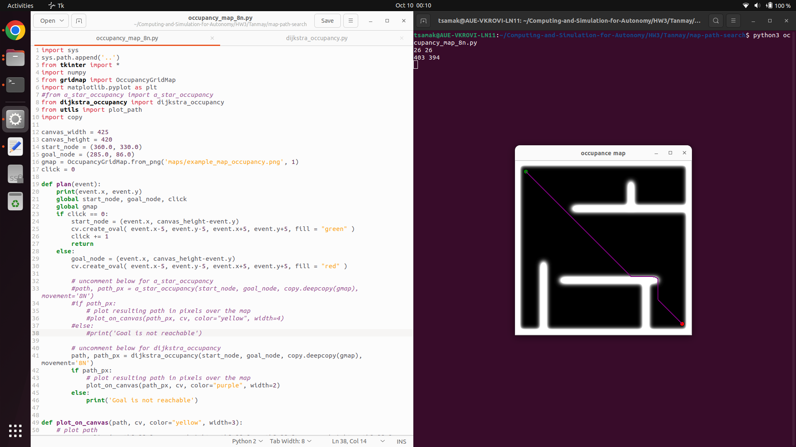

# AuE-8930: Homework 3
**Author:** Tanmay Samak

## CLONE

- Clone this repository:
```bash
$ git clone https://github.com/Tinker-Twins/Computing-and-Simulation-for-Autonomy.git
```

- Change directory to Tanmay's HW3:
```bash
$ cd Computing-and-Simulation-for-Autonomy/HW3/Tanmay
```

## BUILD

- Compile the C++ program for questions `Q1` to `Q5` and `Q7` to `Q8`:
```bash
$ g++ Q1.cpp -o Q1
$ g++ Q2.cpp -o Q2
$ g++ Q3.cpp -o Q3
$ g++ Q4.cpp -o Q4
$ g++ Q5.cpp -o Q5
$ g++ Q7.cpp -o Q7
$ g++ Q8.cpp -o Q8
```

-  For `Q6`, the build instructions are a little different:

You will first need to install OpenCV.

Update/upgrade `apt` packages:
```bash
$ sudo apt update
$ sudo apt upgrade
```

Install core OpenCV libraries:
```bash
$ sudo apt install libopencv-dev
```

[Optional] Install OpenCV with Python3 bindings:

```bash
$ sudo apt install python3-opencv
```

Now compile the C++ program for `Q6`, with the necessary flags to link against OpenCV libraries:
```bash
$ g++ Q6.cpp -o Q6 `pkg-config opencv4 --cflags --libs`
```

## RUN

- Run the executable for questions `Q1` to `Q8`:
```bash
$ ./Q1
$ ./Q2
$ ./Q3
$ ./Q4
$ ./Q5
$ ./Q6
$ ./Q7
$ ./Q8
```

- For `Q9` execute the respective Python scripts:

Assuming that you are already in `Computing-and-Simulation-for-Autonomy/HW3/Tanmay` directory, change directory to `map-path-search`:
```bash
$ cd map-path-search
```

For `Q9a_1`, uncomment `a_star_occupancy` section and run:
```bash
$ python3 occupancy_map_8n.py
```

For `Q9a_2`, uncomment `dijkstra_occupancy` section and run:
```bash
$ python3 occupancy_map_8n.py
```

For `Q9b_1`, uncomment `a_star_quadtree` section and run:
```bash
$ python3 quadtree_map_8n.py
```

For `Q9b_2`, uncomment `dijkstra_quadtree` section and run:
```bash
$ python3 quadtree_map_8n.py
```

For `Q9c_1a`, change the resolution, uncomment both `a_star_occupancy` and `dijkstra_occupancy` sections and run:
```bash
$ python3 occupancy_map_8n.py
```

For `Q9c_1b`, change the resolution, uncomment both `a_star_quadtree` and `dijkstra_quadtree` sections and run:
```bash
$ python3 quadtree_map_8n.py
```

For `Q9c_2a`, uncomment both `a_star_occupancy` and `dijkstra_occupancy` sections and run:
```bash
$ python3 occupancy_map_8n.py
```

For `Q9c_2b`, uncomment both `a_star_quadtree` and `dijkstra_quadtree` sections and run:
```bash
$ python3 quadtree_map_8n.py
```

## RESULTS

1. A sample execution for `Q1` is depicted below:


The time complexity of this algorithm is ***O(n)***, where *n* is the number of elements in the array, because the map operations (insertion and retrieval) are done in constant time on average.

2. A sample execution for `Q2` is depicted below:


The time complexity of this algorithm is ***O(n)***, where *n* is the number of nodes in the binary tree, as it visits each node exactly once.

3. A sample execution for `Q3` is depicted below:


The time complexity of this algorithm is ***O(max(n, m))***, where *n* is the length of the first linked list `l1` and *m* is the length of the second linked list `l2` (worst case scenario). This is because the while loop runs until both linked lists (`l1` and `l2`) are fully traversed or until the carry becomes zero. In the worst case, it will iterate through the longer of the two input lists. Within the loop, each iteration involves constant time operations such as addition, modulo, and updating pointers, all of which take *O(1)* time. After the loop, if there's a carry, an additional node is added to the result, which takes *O(1)* time. Since the number of iterations in the while loop is determined by the length of the longer linked list among `l1` and `l2`, the time complexity is *O(max(N, M))*.

4. A sample execution for `Q4` is depicted below:


The time complexity of this algorithm is ***O(n)***, where *n* is the length of the input string.

5. A sample execution for `Q5` is depicted below:


The time complexity of this algorithm is ***O(n)***, where *n* is the length of the input string, as it iterates through the string once. The space complexity is also ***O(n)*** because in the worst case, the stack can contain all opening brackets.

6. A sample execution for `Q6` is depicted below:


7. A sample execution for `Q7` is depicted below:


The time complexity of this algorithm is ***O(n)***, where *n* is the number of nodes in the binary tree. This is because we perform a depth-first search (DFS) traversal of the binary tree, visiting each node exactly once. At each node, we perform constant-time operations to check if it's a leaf node and if the current sum equals the target sum. In the worst case, we visit all *n* nodes in the binary tree to explore all possible paths.

8. A sample execution for `Q8` is depicted below:


The time complexity of this algorithm is ***O(n)***, where *n* is the length of the input strings, as it makes a single pass through both strings.

9. Map path search:

|  |  |
|:--------:|:-------------:|
| A* Occupancy Grid | Dijkstra Occupancy Grid |
|  |  |
| A* Quadtree | Dijkstra Quadtree |
|  |  |
| A* Resolution | Dijkstra Resolution |
|  |  |
| A* and Dijkstra Occupancy Grid | A* and Dijkstra Occupancy Grid |

The time complexity of pathfinding algorithms like A* and Dijkstra's algorithm can vary depending on the data structures and heuristics used, as well as the specifics of the problem and the map representation. Here, I'll discuss the time complexity for both occupancy grid-based and quadtree-based implementations of A* and Dijkstra's algorithm.

- **Occupancy Grid-Based Algorithms:**
  - ***Dijkstra's Algorithm (Grid-Based):***
    - ***Time Complexity:*** O((V + E) * log(V)), where V is the number of grid cells (vertices) and E is the number of grid cell connections (edges).
    - ***Explanation:*** Dijkstra's algorithm explores vertices in increasing order of their distance from the start node. The use of a priority queue (typically implemented as a binary heap) for selecting the next node to expand ensures efficient selection of nodes with the lowest distance.

  - ***A\* Algorithm (Grid-Based):***
    - ***Time Complexity:*** O((V + E) * log(V)) with a good heuristic.
    - ***Explanation:*** A* combines Dijkstra's algorithm with an admissible heuristic that guides the search towards the goal. In practice, A* often performs better than Dijkstra's algorithm because it explores fewer nodes due to the heuristic's guidance. The time complexity is similar to Dijkstra's but with potentially fewer node expansions.

- **Quadtree-Based Algorithms:**
  - ***Dijkstra's Algorithm (Quadtree-Based):***
    - ***Time Complexity:*** O((V + E) * log(V)), where V is the number of tiles (vertices) in the quadtree and E is the number of connections between tiles.
    - ***Explanation:*** The time complexity for Dijkstra's algorithm remains the same as in the grid-based case when applied to a quadtree-based map representation. The data structures used for managing nodes (e.g., priority queues) are the same.

  - ***A\* Algorithm (Quadtree-Based):***
    - ***Time Complexity:*** O((V + E) * log(V)) with a good heuristic.
    - ***Explanation:*** A* with a quadtree-based map representation has a time complexity similar to that of Dijkstra's algorithm. The use of a good heuristic can reduce the number of node expansions, making A* more efficient than Dijkstra's in practice.

In both occupancy grid-based and quadtree-based implementations, the primary factor influencing time complexity is the number of vertices (V) and edges (E) in the graph or map representation. The choice of data structures for managing nodes and the efficiency of the heuristic function also play a role. When a good heuristic is used and the search space is reduced, A* tends to outperform Dijkstra's algorithm in terms of speed.

It's important to note that these time complexities are theoretical upper bounds and can vary in practice based on map characteristics, the quality of the heuristic, and implementation details.
